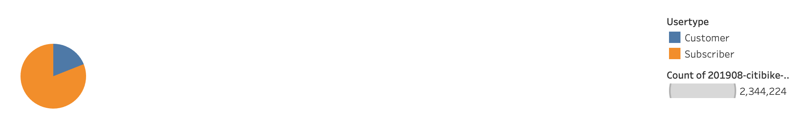
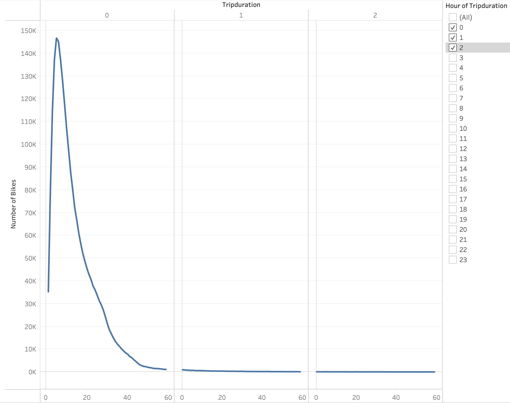
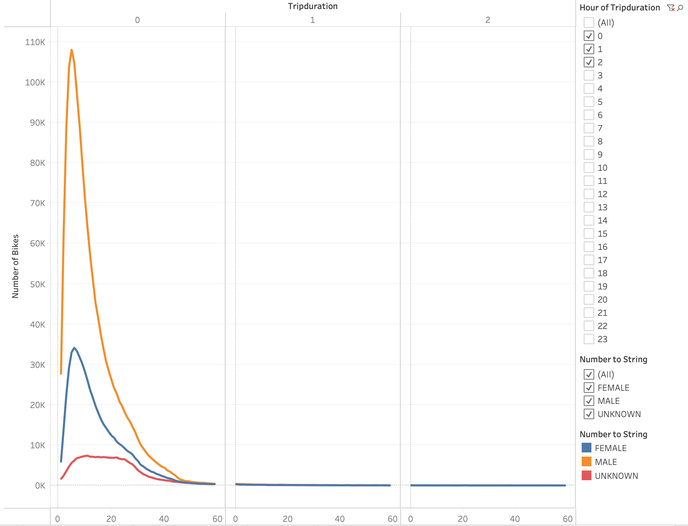
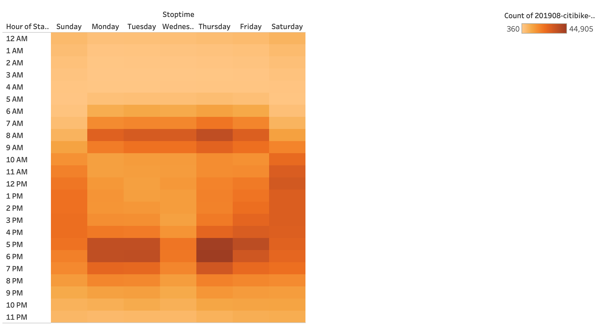
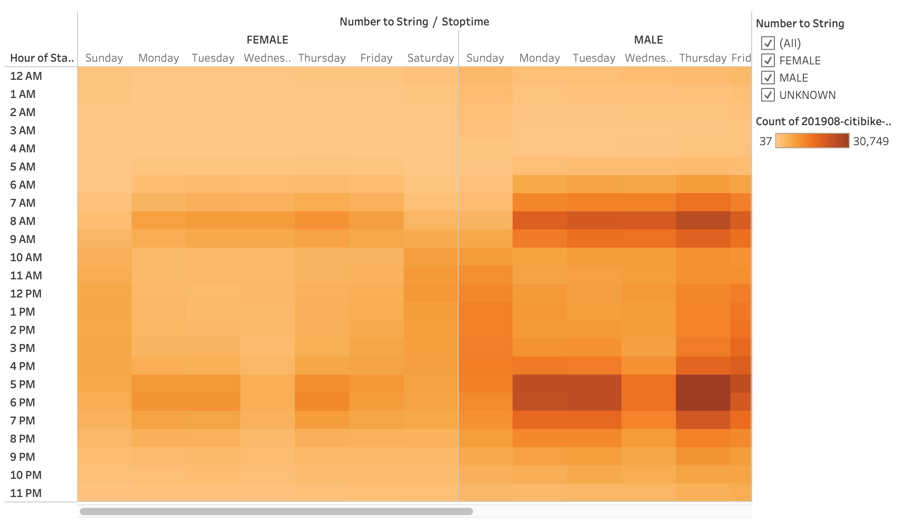
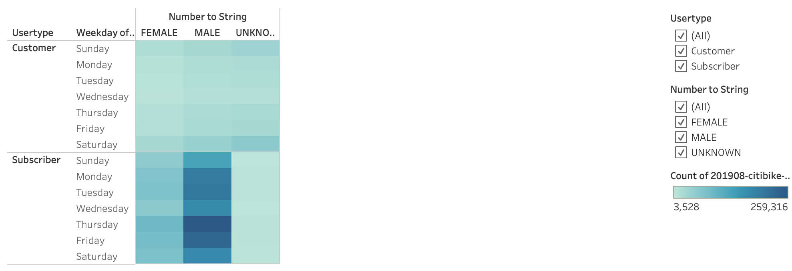
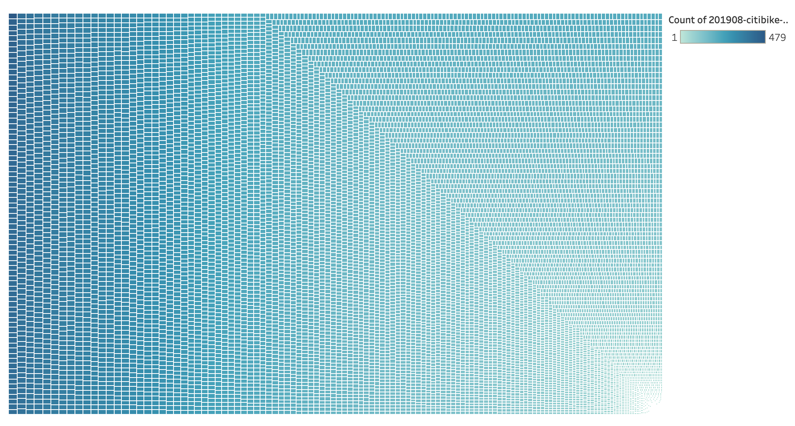

# bikesharing

Tableau Analysis:
[link to dashboard](https://public.tableau.com/profile/paola5421#!/vizhome/CitibikeNYAnalysis/NYCCitibikeAnalysis?publish=yes)

## Overview of the analysis: 
The purpose of this analysis is to use our knowledge of Pandas and Tableau to transform and better visualize trends with Citibike use data in New York City so that investors can better understand the benefits of applying a bike sharing program to the city of Des Moines.

## Results: 
Below are all of the visualizations created using Tableau Story:

The pie chart above shows that out of the 2,344,224 users of Citibike in NYC in August, 81% of users are subcribers to Citibike, and the other 19% are regular customers.

The line chart above shows that the checkout times for users are highest at hour 0, with 5 minutes into the trip duration, with 146,752 number of bikes checked out. At longer trip durations, we see less bikes checked out.

 
The line chart above breaks down the same information as the previous line chart by gender. From the visualization, we can see that the peak in hour 0 of the trip duration, 34,151 bikes were checked out by females, 108,087 bikes were checked out by males, and about 7,389 were checked out by an unknown gender.

 
The heat map above shows that most bikes are rented from 7-9 am and 5-6 pm on weekdays and throughout the day (around 10 am to 7 pm) on weekends. This bike data makes sense, since people are more likely to bike to and from work on weekdays or to workout before and after work hours. On weekends, it makes sense that more bikes are rented throughout the day, as less people work during those hours on weekends.

The heat map above shows the same information as the previous heatmap, but with the bike data broken down by gender. From the heatmap, it is clear that overall, more males bike from 7-9 am and 5-7 pm on weekdays than women. Both genders also bike more on saturdays and sundays throughout the day, as most people have weekends off.

The heat map above shows bike trips by user type, gender, and weekday. From the heatmap, it is clear that subscribers bike a lot more than customers, with males subscribers biking substantially more than females. Bike usage among men stays above 100,000 bikes every day of the week, whereas the female bike rides never reach 100,000 on any weekday.

The image above shows information on bikes that need bike repairs based on bike id and usage. This way, the city can keep track of how often they need to do any repairs/maintenance on bikes. As you move from right to left, bike usage increases, meaning bikes on the far left are those that need the more immediate repairs done, due to a higher bike usage amongst customers.

## Summary:
At a high level, it is clear that most bikes are checked out by subscribers, with males in particular checking out more bikes in the mornings before work and in the afternoons after work on weekdays, and throughout the day on weekends. Two additional visualizations that could help interpret the data are a bar chart showing the breakdown of rides by age and gender as well as a heatmap that breaks down the bike use by age, weekday and time of day to better see the variation in users of citibike.
